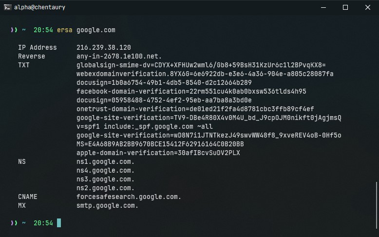

<h3 align="center"> Ersa </h3>
<h4 align="center"> Lookup DNS via command line </h4>

_**install from script**_
```
git clone https://github.com/rulanugrh/ersa.git
cd ersa
sudo ./install.sh
```

_**self build**_
```
git clone https://github.com/rulanugrh/ersa.git
cd ersa
go build -o ersa
```

_**install (windows user)**_
```
you can copy file `build/ersa.exe` if you are arch x64 bit
```

_**how to use**_
```
ersa [DOMAIN_NAME]
```

_*screenshot*_
<div align="center">
    
</div>
